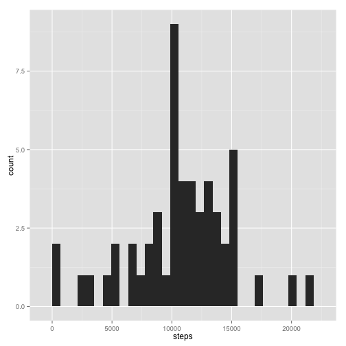

Title
========================================================

Loading and preprocessing the data
-------------------------------------
Show any code that is needed to:
1. Load the data (i.e. read.csv())

```r
setwd("~/Coursera/Reproducible Research/Assignment 1/RepResearch_Assignment1/")
data <- read.csv("activity.csv", header = T)
```
Get a summary of the dataset

```r
str(data)
```

```
## 'data.frame':	17568 obs. of  3 variables:
##  $ steps   : int  NA NA NA NA NA NA NA NA NA NA ...
##  $ date    : Factor w/ 61 levels "2012-10-01","2012-10-02",..: 1 1 1 1 1 1 1 1 1 1 ...
##  $ interval: int  0 5 10 15 20 25 30 35 40 45 ...
```

```r
summary(data)
```

```
##      steps               date          interval   
##  Min.   :  0.0   2012-10-01:  288   Min.   :   0  
##  1st Qu.:  0.0   2012-10-02:  288   1st Qu.: 589  
##  Median :  0.0   2012-10-03:  288   Median :1178  
##  Mean   : 37.4   2012-10-04:  288   Mean   :1178  
##  3rd Qu.: 12.0   2012-10-05:  288   3rd Qu.:1766  
##  Max.   :806.0   2012-10-06:  288   Max.   :2355  
##  NA's   :2304    (Other)   :15840
```
Load the required data sets

```r
library(ggplot2)
library(plyr)
```

2. Process/transform the data (if necessary) into a format suitable for your analysis

```r
# 2. Process/transform the data 
# The date variable is factorial, transform it into a date variable
data$date <- as.Date(data$date)
str(data)
```

```
## 'data.frame':	17568 obs. of  3 variables:
##  $ steps   : int  NA NA NA NA NA NA NA NA NA NA ...
##  $ date    : Date, format: "2012-10-01" "2012-10-01" ...
##  $ interval: int  0 5 10 15 20 25 30 35 40 45 ...
```

```r
summary(data)
```

```
##      steps            date               interval   
##  Min.   :  0.0   Min.   :2012-10-01   Min.   :   0  
##  1st Qu.:  0.0   1st Qu.:2012-10-16   1st Qu.: 589  
##  Median :  0.0   Median :2012-10-31   Median :1178  
##  Mean   : 37.4   Mean   :2012-10-31   Mean   :1178  
##  3rd Qu.: 12.0   3rd Qu.:2012-11-15   3rd Qu.:1766  
##  Max.   :806.0   Max.   :2012-11-30   Max.   :2355  
##  NA's   :2304
```
What is mean total number of steps taken per day?
----------------------------------------
For this part of the assignment, you can ignore the missing values in the dataset.

1. Make a histogram of the total number of steps taken each day

```r
qplot(steps, data = data) + facet_wrap(~ date)
```

```
## stat_bin: binwidth defaulted to range/30. Use 'binwidth = x' to adjust this.
## stat_bin: binwidth defaulted to range/30. Use 'binwidth = x' to adjust this.
## stat_bin: binwidth defaulted to range/30. Use 'binwidth = x' to adjust this.
## stat_bin: binwidth defaulted to range/30. Use 'binwidth = x' to adjust this.
## stat_bin: binwidth defaulted to range/30. Use 'binwidth = x' to adjust this.
## stat_bin: binwidth defaulted to range/30. Use 'binwidth = x' to adjust this.
## stat_bin: binwidth defaulted to range/30. Use 'binwidth = x' to adjust this.
## stat_bin: binwidth defaulted to range/30. Use 'binwidth = x' to adjust this.
## stat_bin: binwidth defaulted to range/30. Use 'binwidth = x' to adjust this.
## stat_bin: binwidth defaulted to range/30. Use 'binwidth = x' to adjust this.
## stat_bin: binwidth defaulted to range/30. Use 'binwidth = x' to adjust this.
## stat_bin: binwidth defaulted to range/30. Use 'binwidth = x' to adjust this.
## stat_bin: binwidth defaulted to range/30. Use 'binwidth = x' to adjust this.
## stat_bin: binwidth defaulted to range/30. Use 'binwidth = x' to adjust this.
## stat_bin: binwidth defaulted to range/30. Use 'binwidth = x' to adjust this.
## stat_bin: binwidth defaulted to range/30. Use 'binwidth = x' to adjust this.
## stat_bin: binwidth defaulted to range/30. Use 'binwidth = x' to adjust this.
## stat_bin: binwidth defaulted to range/30. Use 'binwidth = x' to adjust this.
## stat_bin: binwidth defaulted to range/30. Use 'binwidth = x' to adjust this.
## stat_bin: binwidth defaulted to range/30. Use 'binwidth = x' to adjust this.
## stat_bin: binwidth defaulted to range/30. Use 'binwidth = x' to adjust this.
## stat_bin: binwidth defaulted to range/30. Use 'binwidth = x' to adjust this.
## stat_bin: binwidth defaulted to range/30. Use 'binwidth = x' to adjust this.
## stat_bin: binwidth defaulted to range/30. Use 'binwidth = x' to adjust this.
## stat_bin: binwidth defaulted to range/30. Use 'binwidth = x' to adjust this.
## stat_bin: binwidth defaulted to range/30. Use 'binwidth = x' to adjust this.
## stat_bin: binwidth defaulted to range/30. Use 'binwidth = x' to adjust this.
## stat_bin: binwidth defaulted to range/30. Use 'binwidth = x' to adjust this.
## stat_bin: binwidth defaulted to range/30. Use 'binwidth = x' to adjust this.
## stat_bin: binwidth defaulted to range/30. Use 'binwidth = x' to adjust this.
## stat_bin: binwidth defaulted to range/30. Use 'binwidth = x' to adjust this.
## stat_bin: binwidth defaulted to range/30. Use 'binwidth = x' to adjust this.
## stat_bin: binwidth defaulted to range/30. Use 'binwidth = x' to adjust this.
## stat_bin: binwidth defaulted to range/30. Use 'binwidth = x' to adjust this.
## stat_bin: binwidth defaulted to range/30. Use 'binwidth = x' to adjust this.
## stat_bin: binwidth defaulted to range/30. Use 'binwidth = x' to adjust this.
## stat_bin: binwidth defaulted to range/30. Use 'binwidth = x' to adjust this.
## stat_bin: binwidth defaulted to range/30. Use 'binwidth = x' to adjust this.
## stat_bin: binwidth defaulted to range/30. Use 'binwidth = x' to adjust this.
## stat_bin: binwidth defaulted to range/30. Use 'binwidth = x' to adjust this.
## stat_bin: binwidth defaulted to range/30. Use 'binwidth = x' to adjust this.
## stat_bin: binwidth defaulted to range/30. Use 'binwidth = x' to adjust this.
## stat_bin: binwidth defaulted to range/30. Use 'binwidth = x' to adjust this.
## stat_bin: binwidth defaulted to range/30. Use 'binwidth = x' to adjust this.
## stat_bin: binwidth defaulted to range/30. Use 'binwidth = x' to adjust this.
## stat_bin: binwidth defaulted to range/30. Use 'binwidth = x' to adjust this.
## stat_bin: binwidth defaulted to range/30. Use 'binwidth = x' to adjust this.
## stat_bin: binwidth defaulted to range/30. Use 'binwidth = x' to adjust this.
## stat_bin: binwidth defaulted to range/30. Use 'binwidth = x' to adjust this.
## stat_bin: binwidth defaulted to range/30. Use 'binwidth = x' to adjust this.
## stat_bin: binwidth defaulted to range/30. Use 'binwidth = x' to adjust this.
## stat_bin: binwidth defaulted to range/30. Use 'binwidth = x' to adjust this.
## stat_bin: binwidth defaulted to range/30. Use 'binwidth = x' to adjust this.
## stat_bin: binwidth defaulted to range/30. Use 'binwidth = x' to adjust this.
## stat_bin: binwidth defaulted to range/30. Use 'binwidth = x' to adjust this.
## stat_bin: binwidth defaulted to range/30. Use 'binwidth = x' to adjust this.
## stat_bin: binwidth defaulted to range/30. Use 'binwidth = x' to adjust this.
## stat_bin: binwidth defaulted to range/30. Use 'binwidth = x' to adjust this.
## stat_bin: binwidth defaulted to range/30. Use 'binwidth = x' to adjust this.
## stat_bin: binwidth defaulted to range/30. Use 'binwidth = x' to adjust this.
## stat_bin: binwidth defaulted to range/30. Use 'binwidth = x' to adjust this.
```

 

```r
dates <- data.frame(
  date = as.POSIXct(unique(data$date)),
  steps = tapply(data$steps, data$date, sum))
qplot(steps, data = dates) + geom_histogram()
```

```
## stat_bin: binwidth defaulted to range/30. Use 'binwidth = x' to adjust this.
## stat_bin: binwidth defaulted to range/30. Use 'binwidth = x' to adjust this.
```

 

2. Calculate and report the mean and median total number of steps taken per day

```r
report <- data.frame(
  average_step = tapply(data$steps, data$date, function (x) mean(x, na.rm = T)),
  median_step  = tapply(data$steps, data$date, function (x) median(x, na.rm = T))
)
report
```

```
##            average_step median_step
## 2012-10-01          NaN          NA
## 2012-10-02       0.4375           0
## 2012-10-03      39.4167           0
## 2012-10-04      42.0694           0
## 2012-10-05      46.1597           0
## 2012-10-06      53.5417           0
## 2012-10-07      38.2465           0
## 2012-10-08          NaN          NA
## 2012-10-09      44.4826           0
## 2012-10-10      34.3750           0
## 2012-10-11      35.7778           0
## 2012-10-12      60.3542           0
## 2012-10-13      43.1458           0
## 2012-10-14      52.4236           0
## 2012-10-15      35.2049           0
## 2012-10-16      52.3750           0
## 2012-10-17      46.7083           0
## 2012-10-18      34.9167           0
## 2012-10-19      41.0729           0
## 2012-10-20      36.0938           0
## 2012-10-21      30.6285           0
## 2012-10-22      46.7361           0
## 2012-10-23      30.9653           0
## 2012-10-24      29.0104           0
## 2012-10-25       8.6528           0
## 2012-10-26      23.5347           0
## 2012-10-27      35.1354           0
## 2012-10-28      39.7847           0
## 2012-10-29      17.4236           0
## 2012-10-30      34.0938           0
## 2012-10-31      53.5208           0
## 2012-11-01          NaN          NA
## 2012-11-02      36.8056           0
## 2012-11-03      36.7049           0
## 2012-11-04          NaN          NA
## 2012-11-05      36.2465           0
## 2012-11-06      28.9375           0
## 2012-11-07      44.7326           0
## 2012-11-08      11.1771           0
## 2012-11-09          NaN          NA
## 2012-11-10          NaN          NA
## 2012-11-11      43.7778           0
## 2012-11-12      37.3785           0
## 2012-11-13      25.4722           0
## 2012-11-14          NaN          NA
## 2012-11-15       0.1424           0
## 2012-11-16      18.8924           0
## 2012-11-17      49.7882           0
## 2012-11-18      52.4653           0
## 2012-11-19      30.6979           0
## 2012-11-20      15.5278           0
## 2012-11-21      44.3993           0
## 2012-11-22      70.9271           0
## 2012-11-23      73.5903           0
## 2012-11-24      50.2708           0
## 2012-11-25      41.0903           0
## 2012-11-26      38.7569           0
## 2012-11-27      47.3819           0
## 2012-11-28      35.3576           0
## 2012-11-29      24.4688           0
## 2012-11-30          NaN          NA
```

What is the average daily activity pattern?
--------------------------------------------
1. Make a time series plot (i.e. type = "l") of the 5-minute interval (x-axis) and the average number of steps taken, averaged across all days (y-axis)

```r
intervalData <- data.frame(
  interval = unique(data$interval),
  average_step = as.numeric(tapply(data$steps, data$interval, function (x) mean(x, na.rm = T)))
)
qplot(interval, average_step, data = intervalData, geom = "line") +
  labs(x = "Interval", y = "Average steps", title = "Average daily activity pattern plot")
```

 

2. Which 5-minute interval, on average across all the days in the dataset, contains the maximum number of steps?

```r
intervalData[which.max(intervalData$average_step), ]
```

```
##     interval average_step
## 104      835        206.2
```

Imputing missing values
-----------------------
Note that there are a number of days/intervals where there are missing values (coded as NA). The presence of missing days may introduce bias into some calculations or summaries of the data.

1. Calculate and report the total number of missing values in the dataset (i.e. the total number of rows with NAs)

```r
summary(data)
```

```
##      steps            date               interval   
##  Min.   :  0.0   Min.   :2012-10-01   Min.   :   0  
##  1st Qu.:  0.0   1st Qu.:2012-10-16   1st Qu.: 589  
##  Median :  0.0   Median :2012-10-31   Median :1178  
##  Mean   : 37.4   Mean   :2012-10-31   Mean   :1178  
##  3rd Qu.: 12.0   3rd Qu.:2012-11-15   3rd Qu.:1766  
##  Max.   :806.0   Max.   :2012-11-30   Max.   :2355  
##  NA's   :2304
```

```r
# only the steps variable contains missing values.
paste("The data set contains", sum(is.na(data$steps)), "missing values")
```

```
## [1] "The data set contains 2304 missing values"
```

2. Devise a strategy for filling in all of the missing values in the dataset. The strategy does not need to be sophisticated. For example, you could use the mean/median for that day, or the mean for that 5-minute interval, etc.

```r
# my strategy is to impute the overall mean for the missing values
```


3. Create a new dataset that is equal to the original dataset but with the missing data filled in.

```r
dataImputed <- data
dataImputed$steps[which(is.na(dataImputed$steps))] <- mean(data$steps, na.rm = T)
```

4. Make a histogram of the total number of steps taken each day and Calculate and report the mean and median total number of steps taken per day. Do these values differ from the estimates from the first part of the assignment? What is the impact of imputing missing data on the estimates of the total daily number of steps?

```r
imputedReport <- data.frame(
  average_step = tapply(dataImputed$steps, dataImputed$date, function (x) mean(x, na.rm = T)),
  median_step  = tapply(dataImputed$steps, dataImputed$date, function (x) median(x, na.rm = T))
)
imputedReport
```

```
##            average_step median_step
## 2012-10-01      37.3826       37.38
## 2012-10-02       0.4375        0.00
## 2012-10-03      39.4167        0.00
## 2012-10-04      42.0694        0.00
## 2012-10-05      46.1597        0.00
## 2012-10-06      53.5417        0.00
## 2012-10-07      38.2465        0.00
## 2012-10-08      37.3826       37.38
## 2012-10-09      44.4826        0.00
## 2012-10-10      34.3750        0.00
## 2012-10-11      35.7778        0.00
## 2012-10-12      60.3542        0.00
## 2012-10-13      43.1458        0.00
## 2012-10-14      52.4236        0.00
## 2012-10-15      35.2049        0.00
## 2012-10-16      52.3750        0.00
## 2012-10-17      46.7083        0.00
## 2012-10-18      34.9167        0.00
## 2012-10-19      41.0729        0.00
## 2012-10-20      36.0938        0.00
## 2012-10-21      30.6285        0.00
## 2012-10-22      46.7361        0.00
## 2012-10-23      30.9653        0.00
## 2012-10-24      29.0104        0.00
## 2012-10-25       8.6528        0.00
## 2012-10-26      23.5347        0.00
## 2012-10-27      35.1354        0.00
## 2012-10-28      39.7847        0.00
## 2012-10-29      17.4236        0.00
## 2012-10-30      34.0938        0.00
## 2012-10-31      53.5208        0.00
## 2012-11-01      37.3826       37.38
## 2012-11-02      36.8056        0.00
## 2012-11-03      36.7049        0.00
## 2012-11-04      37.3826       37.38
## 2012-11-05      36.2465        0.00
## 2012-11-06      28.9375        0.00
## 2012-11-07      44.7326        0.00
## 2012-11-08      11.1771        0.00
## 2012-11-09      37.3826       37.38
## 2012-11-10      37.3826       37.38
## 2012-11-11      43.7778        0.00
## 2012-11-12      37.3785        0.00
## 2012-11-13      25.4722        0.00
## 2012-11-14      37.3826       37.38
## 2012-11-15       0.1424        0.00
## 2012-11-16      18.8924        0.00
## 2012-11-17      49.7882        0.00
## 2012-11-18      52.4653        0.00
## 2012-11-19      30.6979        0.00
## 2012-11-20      15.5278        0.00
## 2012-11-21      44.3993        0.00
## 2012-11-22      70.9271        0.00
## 2012-11-23      73.5903        0.00
## 2012-11-24      50.2708        0.00
## 2012-11-25      41.0903        0.00
## 2012-11-26      38.7569        0.00
## 2012-11-27      47.3819        0.00
## 2012-11-28      35.3576        0.00
## 2012-11-29      24.4688        0.00
## 2012-11-30      37.3826       37.38
```

Are there differences in activity patterns between weekdays and weekends?
-------------------------------------------------------------------------
For this part the weekdays() function may be of some help here. Use the dataset with the filled-in missing values for this part.

1. Create a new factor variable in the dataset with two levels – “weekday” and “weekend” indicating whether a given date is a weekday or weekend day.

```r
dataImputed$weekend <- factor(ifelse(weekdays(dataImputed$date) %in% 
                                       c("zaterdag", "zondag"), 2, 1),
                              labels = c("weekday", "weekend")
)
```

2. Make a panel plot containing a time series plot (i.e. type = "l") of the 5-minute interval (x-axis) and the average number of steps taken, averaged across all weekday days or weekend days (y-axis). The plot should look something like the following, which was creating using simulated data:

```r
dataImputed2 <- ddply(dataImputed, .(interval, weekend), summarize, steps = mean(steps, na.rm=TRUE))
p <- ggplot(dataImputed2, aes(x = interval, y = steps)) + geom_line() + facet_wrap(~ weekend)
p
```

 
